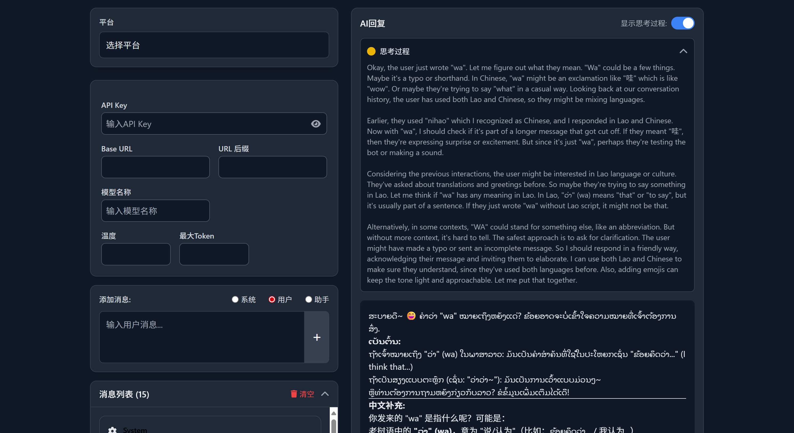

# AIDebugSuite

🎯 专业的AI模型调试与对话测试套件，支持主流大模型API接入与流式交互



## ✨ 功能特性
- 🚀 多模型支持（OpenAI/DeepSeek/智谱等）
- ⚡ 实时流式响应与Markdown渲染
- 🔍 可视化思考链展示（Chain-of-Thought）
- 🔧 可持久化的API配置管理
- 📦 对话历史本地存储
- 🌈 暗黑/亮色主题切换

## 🛠️ 快速开始

### 前置要求
- Node.js 18+
- pnpm

```bash
# 克隆仓库
git clone https://github.com/Jiahui-song/ai-debug-suite.git

# 安装依赖
pnpm install

# 启动开发服务器
pnpm run dev
```

## ⚙️ 配置说明
1. 复制`.env.example`重命名为`.env`
2. 在src/pages/AIDebugPage.tsx中配置您的API密钥
3. 根据需求调整模型参数（温度、最大token数等）

## 📄 开源协议
[MIT License](LICENSE)
